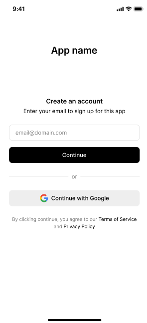
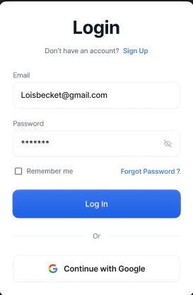
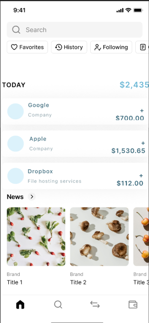
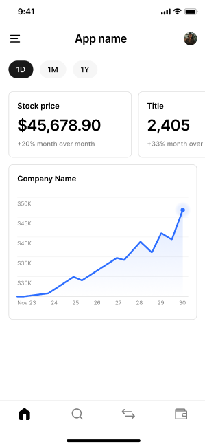

# 📈 StockWatch (Working Title)

**StockWatch** is a side project I'm building in my spare time while working full-time.

The goal of this app is to provide a clean, mobile-friendly way to track stock market movements. It will allow users to:

- View the top 2 gainers and losers of the day
- Search for stocks by name or ticker symbol
- View historical price charts for individual stocks
- [More features to come...]

---

## 🔧 About this version

This is an early version focused on UI prototyping and architecture setup.  
**The UI is provisional** and will likely change as the app evolves.

---

## 📸 Screenshots (UI Preview)

<!-- Add your images here -->

---

## 🛠 Tech Stack

- **Kotlin**
- **Jetpack Compose**

---

## 🚧 Status

Work in progress. Updates will be pushed as I continue building the app on nights and weekends.

---

## 📬 Feedback

Feel free to open an issue or suggest improvements. This is a learning project, so all constructive feedback is welcome!
